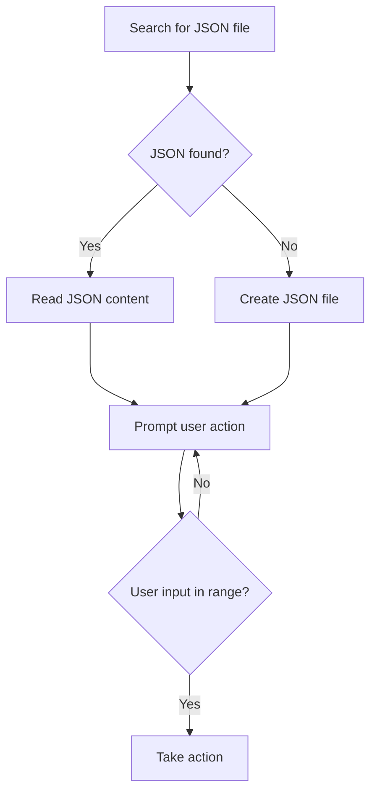

## Phonebook app

Create a phonebook app that stores a name and a phone number for each entry:
- Choose an appropriate variable/data type for names and numbers,
- Choose an appropriate data structure for data temporary (in-memory) and permanent (file) storage,
- implement at least the following functionality:
  * Adding a new entry;
  * Editing an existing entry (name or phone number);
  * Deleting an entry by name;
  * Displaying a list of existing entries;
  * Search by name.

You may use [Python documentation](https://www.python.org/doc/) or other learning resourses, but not code examples (such as Stack Overflow) or AI tools (such as Copilot or ChatGPT).

Split the tasks between the team members, implement each item from the list above as a separate function.

Add reasonable commit messages, comment your code and add descriptions to your functions.
```python
def function_name():
 '''this is a function description'''
 code
````

Draw an algorithm flowchart for each function and save them in Markdown files in project root (use [mermaid](https://docs.github.com/en/get-started/writing-on-github/working-with-advanced-formatting/creating-diagrams) tool). Here is a sample digram of how the program starts.


