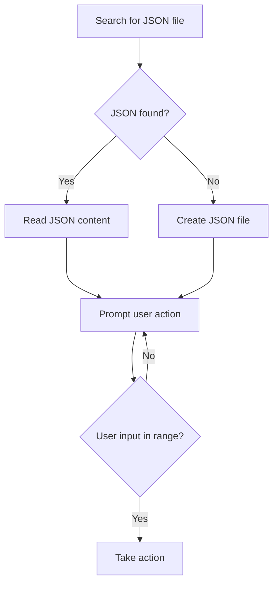

## Phonebook app

Create a phonebook app that stores a name and a phone number for each entry:
- Decide and explain data types you use for entries,
- Choose an appropriate data structure for data temporary (in-memory) and permanent (file) data storage,
- implement at least the following functionality:
  * Adding a new entry;
  * Editing an existing entry (name or phone number);
  * Deleting an entry by name;
  * Displaying a list of existing entries;
  * Search by name.

